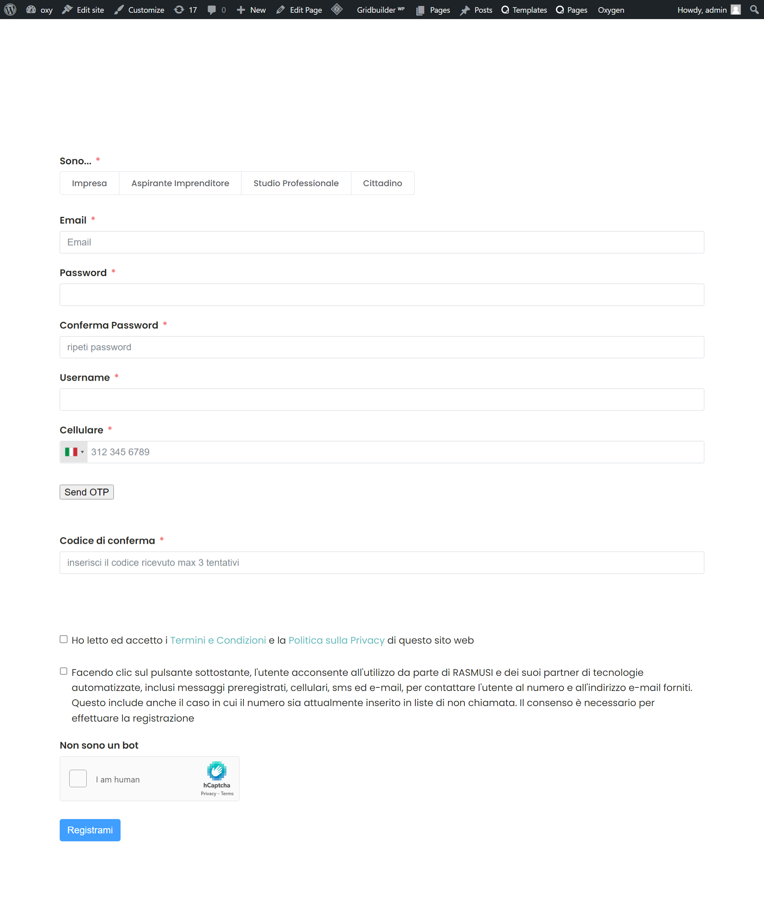

=== SMS OTP Plugin ===
Contributors: imtiazishaque
Tags: WordPress, smsapi, plugin, OTP
Requires at least: 6.0.0

The SMS OTP WordPress plugin adds an extra layer of security to your website.

== Description ==
The SMS OTP WordPress plugin adds an extra layer of security to your website by implementing two-factor authentication through one-time passcodes sent via text message. Users receive a unique code on their mobile phones, ensuring that only authenticated individuals can access sensitive areas of your site. It's a simple yet effective way to enhance login security and protect user accounts from unauthorized access.

== Installation ==
Installing a WordPress plugin. Here's a step-by-step guide:

1. **Log in to Your WordPress Dashboard:**
   - Go to `yoursite.com/wp-admin` and log in.

2. **Navigate to the Plugins Page:**
   - In the left sidebar, find and click on "Plugins."

3. **Click on "Add New":**
   - At the top of the Plugins page, click on the "Add New" button.

4. **Search for the Plugin:**
   - If you know the name of the plugin, you can enter it in the search bar. If not, you can browse through featured plugins or use the "Popular" tab.

5. **Install the Plugin:**
   - Once you find the plugin you want, click the "Install Now" button next to it.

6. **Activate the Plugin:**
   - After the installation is complete, the "Install Now" button will change to "Activate." Click on it to activate the plugin.

7. **Configuration (if needed):**
   - Some plugins may require additional configuration. Look for a new menu item in your dashboard related to the plugin, or check the plugin settings under "Settings" or "Tools."

8. **Manual Installation (if needed):**
   - If you have a plugin that's not listed in the WordPress plugin directory, you may need to manually install it. To do this, download the plugin as a zip file, then go to Plugins > Add New > Upload Plugin and upload the zip file.

9. **Check Compatibility:**
   - Make sure the plugin is compatible with your version of WordPress. This information is usually available on the plugin's page.

10. **Update Regularly:**
    - Keep your plugins updated to benefit from new features, bug fixes, and security patches.

== Screenshots ==
1. screenshot.png

## Demo

